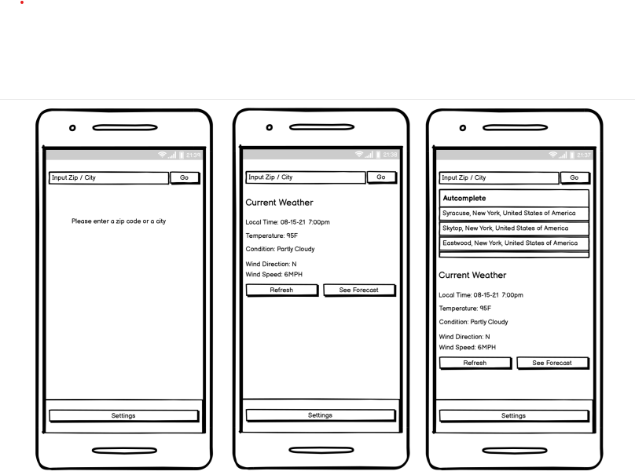
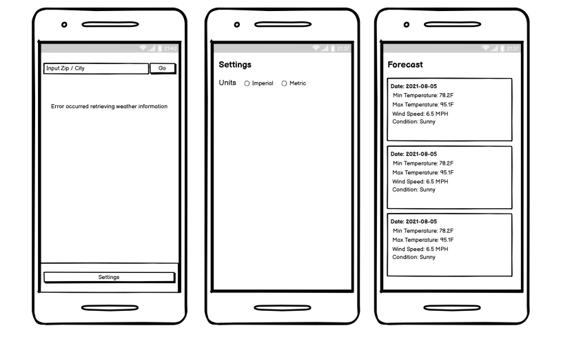

# Penn Interactive Android Assessment

* [Project Overview](#project-overview)
* [User Stories](#user-stories)
* [UI Mocks](#ui-mocks)

## Project Structure
Each user story will have its own branch in the form of `story-{#}-{short description}` so my work can be more easily viewed and progression followed. For example, `story-0-readme-setup` is the branch I used to prep this project. Once a story is complete, the story will be merged into `master` and the finalized product will be on the `master` branch.

## User Stories
1. A user can input a zip code or a city name to retrieve the current weather for the location. 
    1. User can tap go to initiate the query
        1. If a user doesn't enter any characters they should be prompted with a notification saying "Please enter query 
        2. If a user enters less than 3 characters they should be prompted with a notification saying "Please enter more than 3
characters"
        3. If the query succeeds display the information as described in the designs. 

2. If the query fails display an error message in place of the weather information with a message of "Error occurred retrieving weather
information". Please refer to designs. 

3. When viewing current weather, a user can refresh the data
    1. Tapping the refresh button should refresh the weather information 

4. A user can see the forecast for the location they are currently viewing the weather for
    1. Tapping the "See Forecast" button will bring the user to a screen which shows the forecast for the next 3 days. Please refer to
the designs. 

5. A user should be able to see an autocomplete list of locations as they are typing into the input field on the current weather homepage 
    1. Once there are 3 or more characters a list of at most 5 items should appear below the input box.
        1. Tapping on an autocomplete selection should initiate the weather query, dismiss the autocomplete view and clear out
the input field. 

6. A user can change between Imperial and Metric units for Temperature and Wind speed. 
    1. Users can tap settings to open the settings screen 
        1. Users can change between Imperial and metric
            1. This setting should be retained across app launches. 
            2. When imperial is selected temperature should be displayed in Fahrenheit and wind speed in MPH 
            3. When metric is selected temperature should be displayed in celsius and wind speed in KPH 

## UI Mocks

